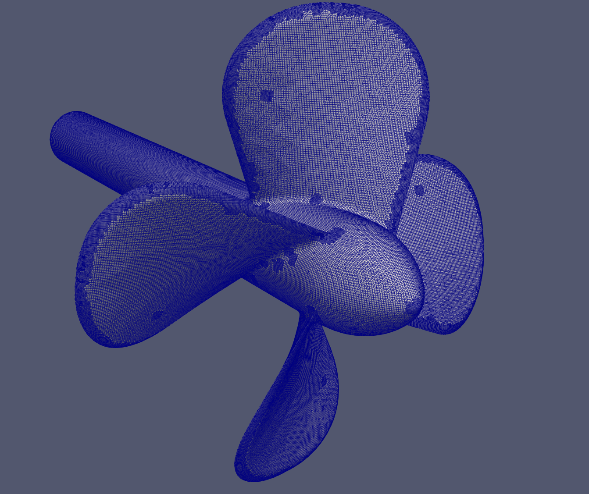
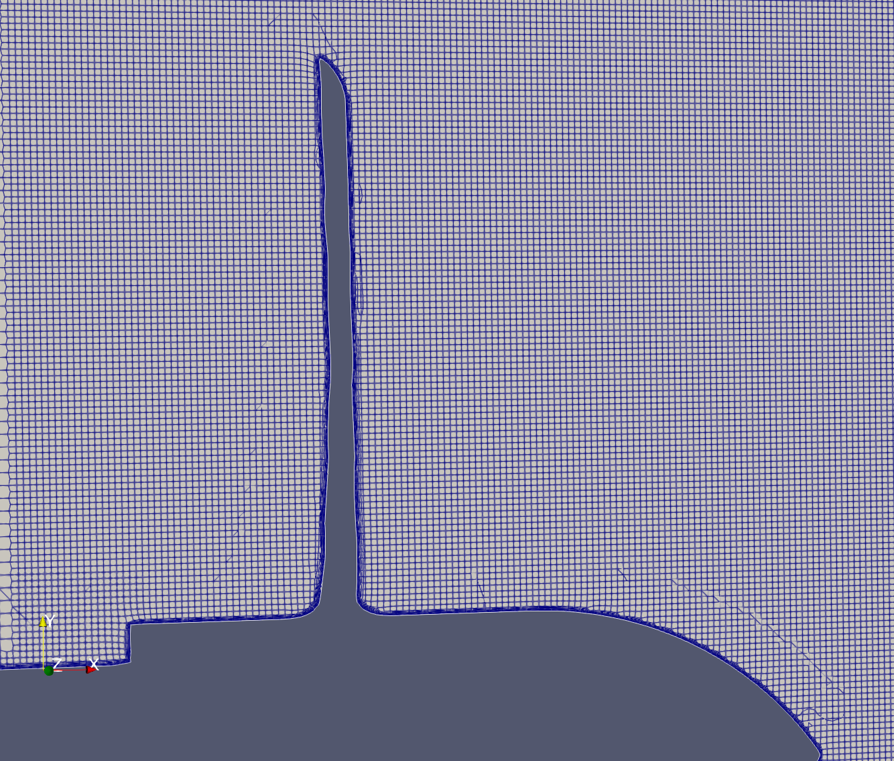
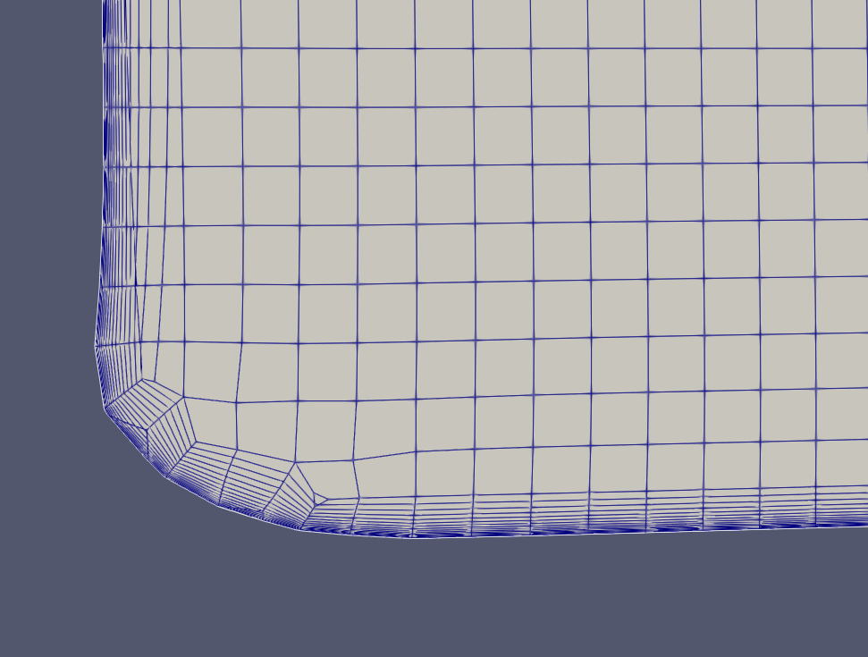
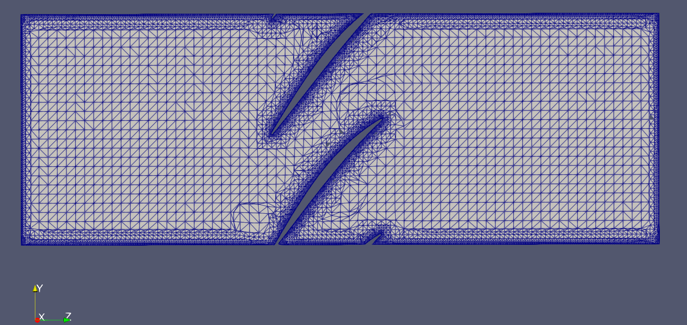
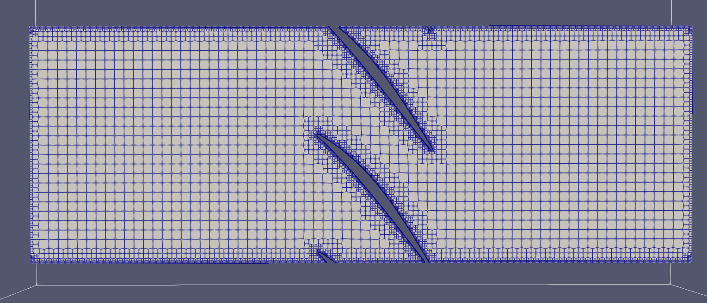
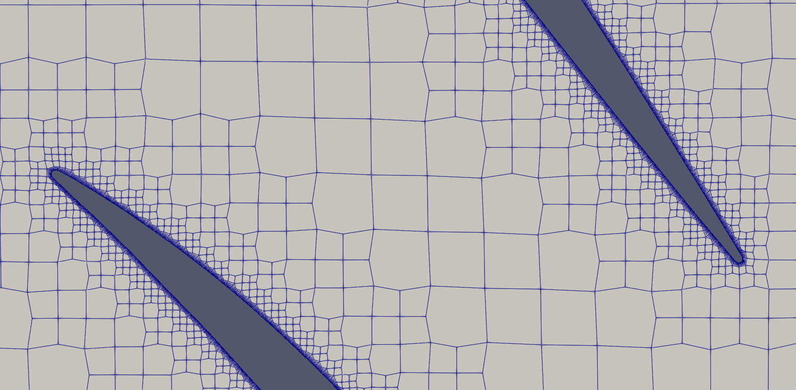
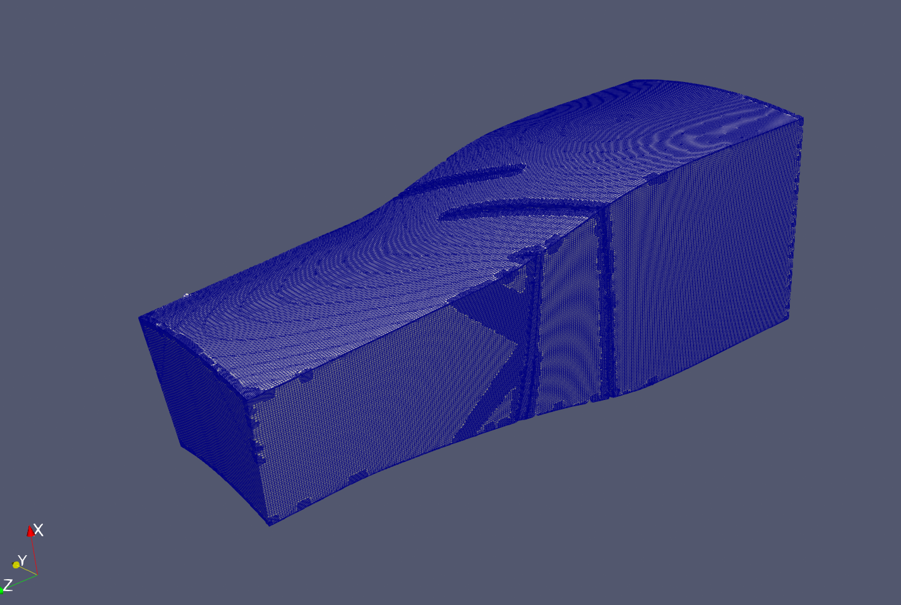

# cfMesh for OpenFOAM Foundation 13

An actively developed fork of cfMesh for OpenFOAM Foundation v13.

NOTE: This release candidate replaces the earlier rc1 development state. The previous build contained boundary-layer quality-recovery behavior that could generate meshes which completed meshing checks but were not sufficiently robust for practical CFD execution. The current rc1 corrects those issues and has now been validated through actual OpenFOAM CFD execution. This mesher is now good enough to produce a mesh that will run CFD, but still fails a few mesh checks that I am currently working on fixing.  More updates to come.


This fork focuses on:

* OpenFOAM 13 compatibility
* Robust Cartesian and polyhedral mesh generation
* Boundary-layer generation near difficult topology
* Deterministic and race-hardened OpenMP behavior
* Transactional mesh-quality repair
* Topology and addressing validation
* Reliable, lossless mesh serialization
* Surface conformance for STL-driven CFD workflows
> **Current status:** `v1.0.0-rc1` release candidate  
> **Current branch:** `release/v1.0.0-rc1`  
> This is a research and development mesher, not a production-certified industrial tool.

The original cfMesh was developed by Franjo Juretić and Creative Fields. This fork preserves the original GPL licensing and authorship while adding extensive OpenFOAM 13 compatibility and robustness work.

## Boundary-layer architecture selection

This fork contains three selectable boundary-layer generation paths. The architecture is selected in `system/meshDict`, allowing users to retain the original cfMesh behavior, use the earlier enhanced implementation, or enable the new constraint-planner pipeline.

| Architecture | Description | Recommended use |
|---|---|---|
| `classicCfMesh` | Preserved classic cfMesh boundary-layer implementation, adapted for OpenFOAM Foundation 13. | Compatibility testing, regression comparisons, and geometries that worked reliably with the original cfMesh approach. |
| `legacyEnhanced` | Heavily modified continuation of the original boundary-layer implementation, including robustness, projection, OpenMP, and transition-handling improvements. | Existing cases developed with earlier versions of this fork. |
| `constraintPlanner` | New CFMitch constraint-planning architecture. It computes explicit per-face layer plans, enforces neighboring-layer compatibility, tracks repair provenance, and supports transactional refinement and rollback. | Current development path and recommended architecture for difficult boundary-layer topology. |

> **Validation status:** The current propeller CFD-execution case and Rotor37 regression documented below were generated using `constraintPlanner`. The propeller case has been successfully advanced in OpenFOAM Foundation 13. Rotor37 currently serves as a difficult-topology meshing and CFD-runnability regression case. In a four-layer `singleOrifice` regression test, `legacyEnhanced` produced a stock-`checkMesh`-clean mesh. The preserved `classicCfMesh` path completed successfully with valid topology and positive cell volumes, but stock `checkMesh` reported one incorrectly oriented face pyramid.

### CFMitch constraint-planner architecture

To use the current CFMitch architecture:

```cpp
boundaryLayers
{
    boundaryLayerArchitecture constraintPlanner;

    constraintPlanner
    {
        maxLayerStep           2;
        neutralProjectionFloor 0.0;

        heightPlanner
        {
            enabled          false;
            maxEdgeRatio     1.50;
            maxMoveFraction  0.05;
            iterations       1;
        }
    }

    // Patch roles and layer definitions follow...
}
```

### Classic cfMesh architecture

To use the preserved classic implementation:

```cpp
boundaryLayers
{
    boundaryLayerArchitecture classicCfMesh;

    // Classic boundary-layer settings follow...
}
```

### Legacy-enhanced architecture

To use the earlier enhanced implementation:

```cpp
boundaryLayers
{
    boundaryLayerArchitecture legacyEnhanced;

    // Enhanced boundary-layer settings follow...
}
```

> **Compatibility note:** These architectures are not expected to produce identical meshes. They represent distinct boundary-layer planning and topology-generation paths. Always run the stock OpenFOAM `checkMesh` utility and inspect boundary-layer junctions before using a generated mesh for CFD.

## CFMitch infrastructure

CFMitch identifies the new robustness, repair, and diagnostic infrastructure developed specifically for this fork. It is not a separate executable. It operates through `cartesianMesh` when the corresponding architecture and controls are selected in `meshDict`.

The CFMitch pipeline includes:

- Explicit boundary-layer constraint planning
- Neighboring-face layer-count compatibility
- Prospective hard/soft boundary-layer quality classification
- Unsupported prospective-column handling that does not convert diagnostic coverage gaps into physical zero-layer requests
- Zero-layer child-allocation guards that preserve parent-cell accounting
- Topology and face-incidence validation
- OpenFOAM-aligned candidate-quality evaluation for signed volume, face pyramids, non-orthogonality, skewness, concavity, and tet decomposition, with hard validity failures kept separate from soft quality diagnostics
- Transactional repair with acceptance or rollback
- Boundary-layer provenance tracking
- Provenance-guided adaptive local layer retreat, including post-Q3 hard-quality recovery
- Addressing validation before and after renumbering
- Safe handling of cells with more than 255 faces
- Lossless mesh-coordinate serialization

The original cfMesh implementation remains available both as a compatibility reference and as a practical fallback for cases where its simpler behavior is preferable.

## Development scope

This is a substantial engineering fork rather than a minimal OpenFOAM compatibility patch. The repository contains a substantial body of modified and newly added code developed during the OpenFOAM 13 port and robustness effort.

The work spans boundary-layer planning and refinement, mesh topology generation, surface projection, geometry optimization, OpenMP race hardening, mesh addressing, diagnostic infrastructure, transactional repair, and mesh serialization.

The modifications span boundary-layer planning and refinement, mesh topology generation, surface projection, geometry optimization, OpenMP race hardening, mesh addressing, diagnostic infrastructure, transactional repair, and mesh serialization.

## What this fork can generate

### Large 16-layer propeller stress-test mesh

<p align="center">
  
  
  
</p>

<p align="center">
  <em>Historical 16-layer propeller stress-test mesh from this development line. The current rc1 CFD-execution validation case is the approximately 8-million-cell, 15-layer propeller mesh documented below.</em>
</p>

### NASA Rotor 37 turbomachinery stress test

<p align="center">
  
  
</p>

<p align="center">
  
  
</p>

<p align="center">
  <em>NASA Rotor37 two-passage sector used to expose difficult blade/endwall junctions, periodic boundaries, acute trailing edges, and boundary-layer transition topology. The current rc1 regression has zero internally detected negative-volume cells, zero bad face pyramids, and no faces above 90° non-orthogonality. Advanced OpenFOAM geometry checks still identify skewness, low-determinant cells, concavity, low interpolation weights, low volume ratios, and face-tet decomposition quality as remaining development targets.</em>

</p>

---

## Current release candidate

The current `v1.0.0-rc1` introduces a new boundary-layer planning and repair architecture together with several important fixes to core mesh handling. This is the first rc1 state in this development line demonstrated to generate a complex propeller mesh that can be successfully advanced in OpenFOAM Foundation 13 CFD.

### Propeller CFD-execution validation

The current rc1 generated and successfully ran an approximately 8-million-cell propeller case using the `constraintPlanner` boundary-layer architecture.

The CFD-execution validation mesh used:

* 15 requested boundary layers
* Thickness ratio 1.2
* Nominal maximum first-layer thickness 56 μm
* Approximately 4.03 mm nominal total BL thickness
* Deterministic `OMP_NUM_THREADS=1` meshing

| Metric                               |         Result |
| ------------------------------------ | -------------: |
| Points                               |      8,184,048 |
| Faces                                |     24,175,994 |
| Internal faces                       |     24,040,844 |
| Cells                                |      7,995,952 |
| Hexahedra                            |      7,907,374 |
| Prisms                               |          3,851 |
| Polyhedra                            |         84,727 |
| Negative-volume cells                |              0 |
| Incorrect face pyramids              |              0 |
| Maximum non-orthogonality            |         78.59° |
| Severely non-orthogonal faces (>70°) |              6 |
| Maximum skewness                     |           3.75 |
| Propeller BL effective face coverage |         96.10% |
| Mesh history                         | `CleanNatural` |

The mesh was successfully advanced in OpenFOAM Foundation 13 using an incompressible k-ω SST MRF setup, and reconstructed `U`, `p`, `k`, `omega`, `nut`, and `yPlus` fields were produced successfully.

A reconstructed y+ evaluation gave a propeller-area average of approximately 7.74. Most of the intact layered blade surface was in the approximate 6–20 range, with a localized high-y+ region at a blade tip where boundary-layer coverage was lost.

This demonstrates practical CFD executability of the current rc1. Quantitative thrust and torque agreement remain under investigation and are not yet claimed as validation accuracy.

### NASA Rotor37 regression stress test

NASA Rotor37 remains the primary difficult-topology regression geometry. It combines:

* Blade/hub/shroud junctions
* Periodic sector boundaries
* Acute trailing-edge geometry
* BL/periodic and BL/no-BL interfaces
* Strong refinement transitions
* Multiple interacting boundary-layer patches

Using the same current rc1 source and the unchanged Rotor37 `meshDict`, the regression run completed successfully with zero internally detected negative volumes, zero bad pyramids, and `meshHistory=CleanNatural`.

| Metric                               | Current rc1 regression |
| ------------------------------------ | ---------------------: |
| Points                               |              5,507,094 |
| Faces                                |             15,415,998 |
| Internal faces                       |             14,822,027 |
| Cells                                |              4,954,515 |
| Hexahedra                            |              4,649,868 |
| Prisms                               |                 64,313 |
| Polyhedra                            |                240,334 |
| Negative-volume cells                |                      0 |
| Incorrect face pyramids              |                      0 |
| Maximum non-orthogonality            |                 89.46° |
| Severely non-orthogonal faces (>70°) |                  1,118 |
| Maximum skewness                     |                  18.83 |
| Highly skew faces                    |                    518 |
| Low-quality face-tet error count     |                 87,576 |
| Small-determinant cells (<0.001)     |              1,626,965 |
| Concave cells                        |                 45,548 |
| Small interpolation-weight faces     |                  3,037 |
| Small volume-ratio faces             |                  1,194 |
| Mesh history                         |         `CleanNatural` |

Boundary-layer effective coverage remained high on the primary blade and endwall surfaces:

* Hub: 99.63%
* Blade 1: 98.78%
* Blade 2: 99.02%
* Blade 3: 99.46%
* Blade 4: 99.78%
* Shroud: 89.49%
* Periodic patches: approximately 79.35%

The advanced `checkMesh -allTopology -allGeometry` regression reports six failed geometry-quality checks. Rotor37 is therefore retained as a demanding CFD-runnability and mesh-quality regression case, not yet as a compressor-performance validation result. Pressure ratio, efficiency, mass flow, and convergence validation remain pending.

---

## Major improvements in `v1.0.0-rc1`

### Constraint-planned boundary layers

The new boundary-layer constraint planner computes a compatible refinement plan before topology generation.

It supports:

* Patch-specific layer counts and heights
* BL, termination, and neutral patch roles
* Layer-count compatibility across adjacent faces
* Maximum layer-step constraints
* Height-first repair planning
* Local layer compression
* Local hard retreat only when an explicit hard geometric or topological constraint requires it; unsupported prospective diagnostics do not automatically delete boundary layers
* Preservation of classic cfMesh behavior as a selectable path

The planner is geometry-driven and does not depend on Rotor37-specific patch names.

### Prospective hard/soft boundary-layer contract

The current rc1 separates prospective conditions that are physically inadmissible from quality diagnostics that should not automatically delete boundary layers.

Hard prospective failures include:

* Invalid prospective topology
* Negative child-cell volume
* Incorrect face-pyramid orientation
* Completed layer interfaces reaching or exceeding 90° non-orthogonality

These conditions may prevent or constrain boundary-layer construction.

Soft prospective diagnostics include:

* Face-tet and shared-tet decomposition quality
* Face/cell concavity diagnostics
* Severe but sub-90° non-orthogonality

Soft diagnostics remain visible in telemetry and stock OpenFOAM validation, but they do not directly terminate otherwise valid boundary-layer columns.

Prospective topology reconstruction is also treated separately from physical layer termination. If the prospective evaluator cannot construct a supported column, the condition is recorded as `unsupportedNoCap`; it is not converted into a zero-layer cap and propagated through the neighboring-face constraint planner.

This distinction prevents diagnostic limitations from causing large, artificial boundary-layer retreat.

### Transactional boundary-layer repair

Boundary-layer repair is evaluated through mesh snapshots rather than applying irreversible mutations.

The repair pipeline can:

1. Preserve the valid pre-refinement mesh
2. Generate and evaluate an initial BL result
3. Build repair plans from failed-face provenance
4. Restore the original topology
5. Retry with locally modified layer constraints
6. Accept only a safer result
7. Roll back rejected attempts

Quality comparisons include:

* Negative-volume cells
* Incorrect face pyramids
* Signed-volume magnitude
* Minimum cell volume
* Non-orthogonality
* Skewness
* Open-cell detection
* Unused-point checks
* Preservation of hard-valid geometry even when soft advanced-quality diagnostics remain


### Adaptive local BL retreat

When an explicitly sourced hard constraint requires local layer reduction, the constraint planner can apply local maximum-layer caps and propagate compatible layer-count ramps to neighboring faces.

The current rc1 deliberately distinguishes this from unsupported prospective evaluation. Unsupported prospective reconstruction does not itself request physical BL deletion.

The retained retreat infrastructure includes:

* Failed-face provenance
* Explicit local maximum-layer overrides
* Neighboring-face compatibility propagation
* Compression context retained during retreat
* Acceptance against valid baselines
* Rollback of rejected repair candidates

This allows genuinely constrained geometry to retreat locally without turning soft quality warnings or prospective-model coverage gaps into broad zero-layer regions.

### Generated-child topology audits

New diagnostic gates validate refined cell shells before and after face relabeling.

Checks include:

* Every child edge used exactly twice
* No malformed faces
* No repeated consecutive face vertices
* Valid cell-to-face references
* Closed generated child shells
* Closed cells before final relabeling
* Closed cells after final relabeling
* Correct final face incidence
* No unused, singly misclassified, or multiply owned internal faces

These checks cover refinement types 0–3 and appended child cells.

### Final face-incidence validation

Before committing the generated topology, the mesher verifies that:

* Every internal face is referenced by exactly two cells
* Every boundary face is referenced by exactly one cell
* No face is unused
* No face is referenced by three or more cells
* Every cell face reference is in range
* The derived internal-face boundary agrees with patch metadata

### Owner/neighbour addressing coherency

Snapshot and retry operations can replace points, faces, and cells wholesale. Earlier cache invalidation paths did not always discard cached owner/neighbour arrays associated with the previous topology.

The current implementation:

* Clears owner/neighbour addressing after topology restoration
* Rebuilds addressing before renumbering
* Audits addressing before renumbering
* Audits addressing after renumbering
* Audits addressing after boundary replacement
* Aborts instead of writing a corrupted mesh if final addressing is invalid

### Zero-layer allocation safety

A zero-layer boundary direction means that no boundary-layer subdivision is performed in that direction; it does not mean that the parent cell disappears.

Earlier child-count prediction multiplied the expected replacement-cell count directly by the requested face-layer count. A zero-layer face could therefore drive the predicted replacement count to zero while later refinement logic still preserved or appended children. This under-allocated cell storage and could produce invalid memory writes.

The current rc1 clamps the allocation factor to at least one for zero-layer directions:

```cpp
const label cellCountFactor =
    Foam::max(faceLayers, label(1));
```

Additional diagnostics and append-bound guards verify that predicted child allocation cannot silently fall below the required storage.

### `replaceBoundary` wide-counter fix

The original boundary replacement implementation used:

```cpp
List<direction> nFacesInCell
```

A `direction` is too narrow for cells containing more than 255 faces. Counter overflow silently truncated cell face lists during boundary replacement.

This became visible in the propeller stress test, which contains two 291-face polyhedral cells. Each affected counter wrapped at 256, corrupting the written mesh even though the pre-replacement topology was valid.

The counter now uses:

```cpp
List<label> nFacesInCell
```

This fix restored all cell face references and eliminated millions of apparently illegal cells reported by stock `checkMesh`.

### Lossless mesh serialization

Low-precision ASCII output previously rounded sensitive coordinates enough to introduce face-pyramid errors that were absent from the in-memory mesh.

The mesh writer now enforces at least:

```cpp
std::numeric_limits<scalar>::max_digits10
```

For a double-precision OpenFOAM build, this results in 17 significant digits. The requested output format—ASCII or binary—is preserved.

The current rc1 propeller CFD-execution case and Rotor37 regression mesh were both written with this lossless serialization path enabled.

This provides numerical round-trip consistency between:

* The final in-memory mesh
* The written `constant/polyMesh`
* The mesh reconstructed by stock OpenFOAM utilities

### OpenFOAM primitive-mesh parity diagnostics

The generator includes a parity audit modeled on stock OpenFOAM calculations for:

* Cell centres
* Signed cell volumes
* Face pyramids
* Internal-face non-orthogonality
* Face skewness

This distinguishes actual generator defects from differences caused by serialization or by cfMesh/OpenFOAM geometric conventions.

---

## Additional robustness work

### Surface-constrained optimization

Boundary points can be constrained to their appropriate STL regions during optimization, reducing surface drift near patch interfaces.

The implementation includes:

* Patch-aware surface projection
* Feature-edge and corner classification
* BL/no-BL protection
* BL/neutral protection
* Limited-displacement reprojection
* Transactional acceptance and rollback
* Surface-drift diagnostics

### Parallel hardening

Numerous race-sensitive shared writes have been serialized or restructured, including:

* Boundary-node construction
* Laplacian smoother apply loops
* Surface-optimizer apply loops
* Boundary-layer vertex maps
* Front-point marking
* Tet and triangle update-type marking
* Boundary addressing flags
* Topology-changing repair loops
* Unguarded parallel map access

`OMP_NUM_THREADS=1` remains the preferred deterministic debugging and regression mode. Parallel repeatability has improved substantially, but high-thread-count validation remains ongoing.

### Geometry and numerical guards

The fork includes guards and recovery behavior for:

* Degenerate faces
* Zero-length vectors
* Zero-volume tetrahedra
* Invalid boundary-point addressing
* Missing map entries
* Octree search failures
* Excessive recursion
* Uninitialized over-allocation
* Invalid split-edge metadata
* Stagnating mesh untangling
* Unsafe optimizer results

---

## Supported executables

| Component           | Status                                    |
| ------------------- | ----------------------------------------- |
| `cartesianMesh`     | Primary supported mesher; actively tested |
| `tetMesh`           | Builds successfully; experimental         |
| `pMesh`             | Builds successfully; experimental         |
| `libmeshLibrary.so` | Core cfMesh library                       |

---

## Branch status

| Branch               | OpenFOAM version | Status                    |
| -------------------- | ---------------- | ------------------------- |
| `release/v1.0.0-rc1` | Foundation v13   | Current release candidate |
| `master`             | Foundation v13   | Previous development line |
| `openfoam12-archive` | OpenFOAM 12      | Archived                  |

---

## Quick start

### Requirements

* OpenFOAM Foundation v13
* Ubuntu 22.04 or compatible Linux environment
* GCC toolchain compatible with the OpenFOAM installation
* C++17 filesystem support
* WSL2 is supported for development and testing

### Clone and build the release candidate

```bash
source /opt/openfoam13/etc/bashrc

git clone https://github.com/Ultravis66/cfMesh-OpenFOAM13.git cfMesh
cd cfMesh

git switch release/v1.0.0-rc1

./Allwclean
./Allwmake
```

Verify the build:

```bash
ls "$FOAM_USER_APPBIN" |
grep -E 'cartesianMesh|tetMesh|pMesh'

ls "$FOAM_USER_LIBBIN/libmeshLibrary.so"
```

### Run the unit-cube tutorial

```bash
cd tutorials/cartesianMesh/unitCube

export OMP_NUM_THREADS=1

cartesianMesh 2>&1 |
tee log.cartesianMesh

checkMesh -constant 2>&1 |
tee log.checkMesh
```

---

## Recommended validation workflow

Always inspect the text produced by `checkMesh`. On some OpenFOAM versions, `checkMesh` can return process exit code zero even when geometric checks fail.

```bash
checkMesh -constant 2>&1 |
tee log.checkMesh

grep -E \
'Mesh OK|Failed|negative|non-orthogonality|face pyramids|skewness' \
log.checkMesh
```

For full advanced geometry regression testing during development, use:

```bash
checkMesh -constant -allTopology -allGeometry -writeSets 2>&1 |
tee log.checkMesh.allGeometry
```

The advanced geometry checks are intentionally retained even when they report quality populations in difficult anisotropic boundary-layer or transition regions.


For development comparisons, use:

```bash
export OMP_NUM_THREADS=1
```

before running `cartesianMesh`.

A generated mesh should not be accepted solely because the mesher exits successfully. At minimum, verify:

* Boundary definition
* Cell-to-face addressing
* Point usage
* Upper-triangular ordering
* Region count
* Cell volumes
* Face pyramids
* Non-orthogonality
* Skewness
* Surface conformity in ParaView

---

## Boundary-layer controls

Boundary-layer behavior is configured in `system/meshDict`.

The current architecture supports concepts such as:

```text
boundaryLayers
{
    boundaryLayerArchitecture constraintPlanner;

    terminationPatches
    (
        inlet
        outlet
    );

    patchBoundaryLayers
    {
        // Patch-specific layer settings
    }
}
```

Important controls include:

| Control                            | Purpose                                                |
| ---------------------------------- | ------------------------------------------------------ |
| `boundaryLayerArchitecture`        | Select constraint-planned or classic behavior          |
| `patchBoundaryLayers`              | Patch-specific BL layer counts and heights             |
| `terminationPatches`               | Identify inlet/outlet-style BL termination patches     |
| `preRefBLAutoRepair`               | Enable pre-refinement snapshotting and transactional BL repair |
| `constrainOptimizerBoundaryMotion` | Constrain boundary motion to surface geometry          |
| `postBLSnap`                       | Enable the experimental post-optimization surface snap |
| `geometryPreprocessing`            | Configure optional near-coincident STL vertex handling |

Not every control is appropriate for every geometry. Validate each configuration using stock OpenFOAM utilities and visual inspection.

---

## Current limitations

* The current rc1 has been demonstrated to generate a propeller mesh that can be consumed and advanced successfully by OpenFOAM Foundation 13. This is a CFD-execution validation result, not yet a quantitative thrust/torque accuracy claim.
* Localized boundary-layer loss can still occur at exceptionally difficult blade-tip geometry. The current propeller case retains approximately 96% effective BL face coverage, with the visually significant loss concentrated in a small tip region.
* OpenFOAM advanced `checkMesh -allTopology -allGeometry` diagnostics can still report low-quality face-tet decompositions, small determinant cells, concavity, small interpolation weights, and small volume ratios. These diagnostics remain enabled and visible.
* The current Rotor37 regression has zero internally detected negative-volume cells and zero bad pyramids, but advanced OpenFOAM geometry checks still report six failed quality criteria.
* Rotor37 currently contains 1,118 severely non-orthogonal faces above 70° (none above 90°), 518 highly skew faces, and a large low-determinant-cell population. CFD performance validation is still pending.
* Very small first-layer heights and large layer counts require case-specific validation.
* Feature-thickness / medial-axis awareness for opposing BL fronts remains a planned robustness improvement.
* Bounded topology-neutral geometry repair for soft BL-quality failures remains a planned development area.
* Surface-constrained optimization can significantly increase runtime.
* `OMP_NUM_THREADS=1` remains the reference mode for deterministic regression testing.
* High-thread-count OpenMP repeatability remains under investigation.
* `tetMesh` and `pMesh` are not validated to the same level as `cartesianMesh`.
* This project is not production-certified.
* Users must validate every mesh independently.

---

## NASA Rotor37 stress-test workflow

A Rotor37 setup may be prepared using:

```bash
mkdir -p ~/rotor37_mesh/constant/triSurface
mkdir -p ~/rotor37_mesh/system

cp /path/to/Rotor37_cfmesh.stl \
    ~/rotor37_mesh/constant/triSurface/

cp tutorials/rotor37/system/meshDict \
    ~/rotor37_mesh/system/
```

Run deterministically:

```bash
cd ~/rotor37_mesh

export OMP_NUM_THREADS=1

cartesianMesh 2>&1 |
tee log.Rotor37

checkMesh -constant 2>&1 |
tee log.checkMesh.Rotor37
```

Rotor37 results are sensitive to geometry preparation, refinement settings, first-layer height, layer count, active repair controls, and solver numerics. The current rc1 Rotor37 result should be treated as a regression and CFD-runnability case rather than a validated compressor-performance solution. Historical metric ranges should not be treated as universal acceptance thresholds.

---

## Selected OpenFOAM 13 API updates

| Original usage                      | OpenFOAM 13 update                      |
| ----------------------------------- | --------------------------------------- |
| `Pstream::blocking`                 | `Pstream::commsTypes::blocking`         |
| `Pstream::scheduled`                | `Pstream::commsTypes::scheduled`        |
| `Pstream::nonBlocking`              | `Pstream::commsTypes::nonBlocking`      |
| `eigenVector(T, scalar)`            | `eigenVectors(T)` with component access |
| `circumCentre()` / `circumRadius()` | `circumSphere().first()` / `.second()`  |
| `isFile()`                          | `std::filesystem::exists()`             |
| `unallocLabelList`                  | `labelList`                             |
| Legacy edge-mesh includes           | Updated `meshTools` include paths       |

---

## Release history

| Version      | Summary                                                                                                                                                                                                                            |
| ------------ | ---------------------------------------------------------------------------------------------------------------------------------------------------------------------------------------------------------------------------------- |
| `v1.0.0-rc1` | CFD-runnable release candidate: constraint-planned boundary layers, prospective hard/soft quality classification, zero-layer allocation safety, `unsupportedNoCap` semantics, transactional repair, generated-child closure and addressing audits, lossless serialization, successful propeller CFD execution, and Rotor37 regression meshing. |

| `v0.10`      | Surface-constrained optimizer and limited-displacement boundary reprojection                                                                                                                                                       |
| `v0.9`       | Expanded parallel hardening and optimizer/untangler fixes                                                                                                                                                                          |
| `v0.8.x`     | BL/BL and BL/neutral transition infrastructure, geometry preprocessing, and broad codebase safety audit                                                                                                                            |
| `v0.7.x`     | BL/no-BL and BL/neutral edge constraint system                                                                                                                                                                                     |
| `v0.6`       | Initial deterministic optimizer hardening                                                                                                                                                                                          |
| `v0.1–v0.5`  | OpenFOAM 13 port, surface mapping fixes, quality evaluation, and targeted repair                                                                                                                                                   |

`v1.0.0` will remain reserved for a final release after broader CFD validation, additional regression testing, and further work on difficult boundary-layer tip and feature-thickness handling.

---

## Original cfMesh

* Original project: https://sourceforge.net/projects/cfmesh/
* Original authors include Franjo Juretić, Philippose Rajan, and Ivor Clifford
* Original copyright and authorship remain with their respective owners

---

## License and attribution

This project is licensed under the GNU General Public License v3.0, consistent with the original cfMesh license.

This fork includes OpenFOAM Foundation v13 compatibility updates and meshing-robustness modifications by Mitchell Stolk.

Modifications in this fork:

```text
Copyright (C) 2026 Mitchell Stolk
```

Suggested attribution:

```text
Mitchell Stolk, cfMesh-OpenFOAM13:
OpenFOAM Foundation 13 port and robustness-focused cfMesh fork, 2026.
```

If this fork is useful in academic research, engineering evaluation, commercial assessment, or public technical work, attribution to this repository is appreciated.

---

## Disclaimer

This is an unofficial community fork. It is not affiliated with Creative Fields or the OpenFOAM Foundation.

The software is provided without warranty. Users are responsible for validating mesh topology, geometry, numerical quality, and solver suitability for every application.

Successful CFD execution demonstrates solver compatibility and mesh usability, but does not by itself establish quantitative physical accuracy. Users should independently validate forces, moments, pressure ratios, efficiencies, mass flow, and convergence behavior against appropriate reference data.

